# Instagram Clone
This is an application I built using Mongo, Express, React, Sass, and Redux that clones Instagram. Given that instagram is a massive application, the scope of the project was limited to implementing the specific features of instagram outlined below. 

The project is deployed at https://instagramwebclone.herokuapp.com/. A note that since the project is deployed on the free tier of Heroku, it will run slowly. 

## Features
- Individuals can register for an account, which requires their email, username, name and password
- User can login using their credentials (email/username, password). Logged in users obtain Json Web Tokens (access token, refresh token)
- User can upload a profile picture and edit their name, username, email and password after registration
- User can upload images
- User can see all the images they have uploaded in the order in which they were uploaded, with infinite scrolling supported for profile pages 
- Users can follow and unfollow other users
- User can see a global feed of images sorted on the homepage from all the users they follow, with infinite scrolling supported on every users homepage
- Search feature allows user to search for other users on the app
- Clicking on an image on a users profile page focuses in on it with its associated information such as likes and comments
- Static versions of user stories and suggested users implemented on homepage
- Static versions of notifications for user implemented
- Fully responsive Design


## Screenshots
Login page 
<br> 
<kbd>
  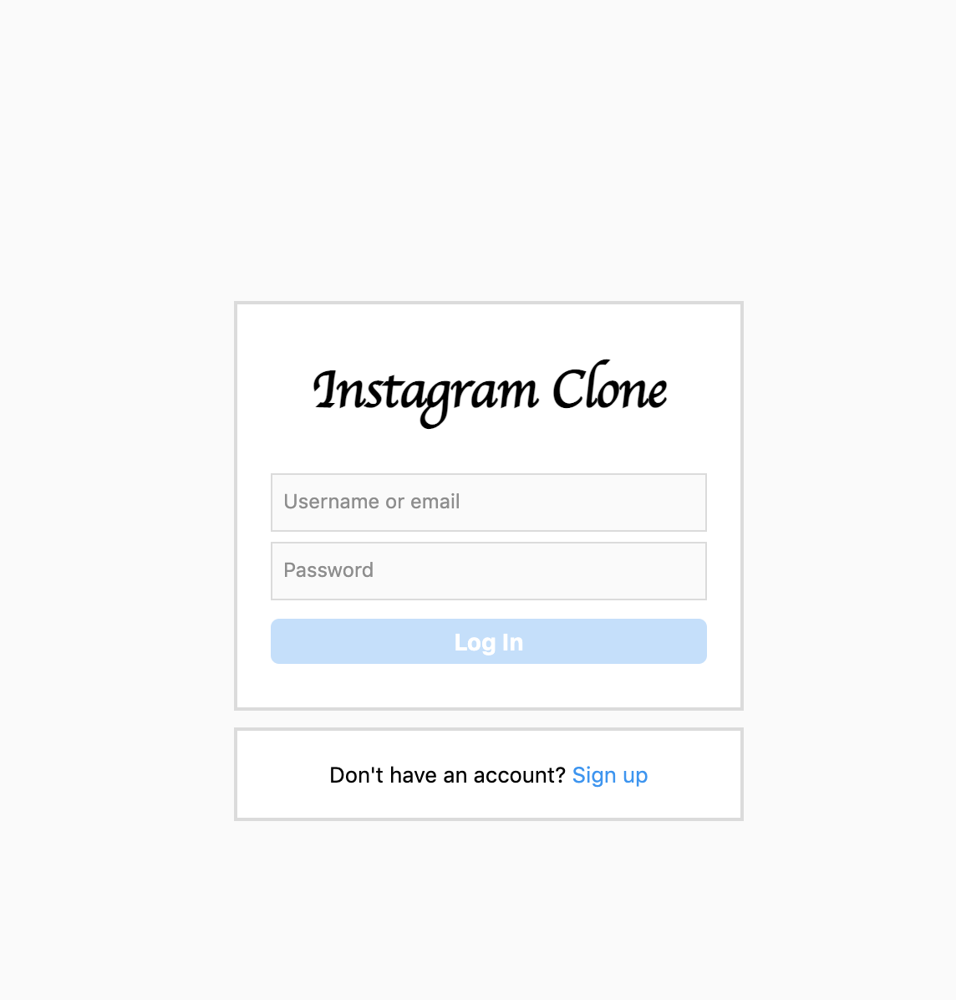
</kbd>
<br> 
<br> 
<br> 

Register page
<br> 
<kbd>
  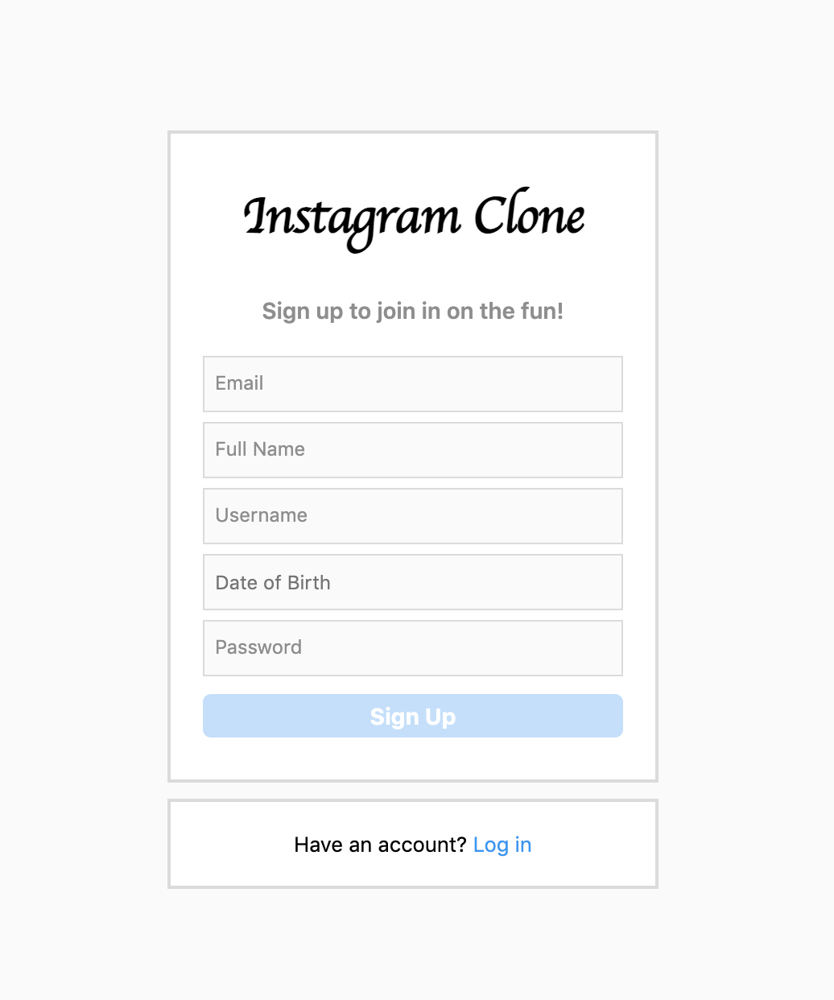
</kbd>
<br> 
<br> 
<br> 

When user logs in, they are redirected to their profile page 
<br> 
<kbd>
  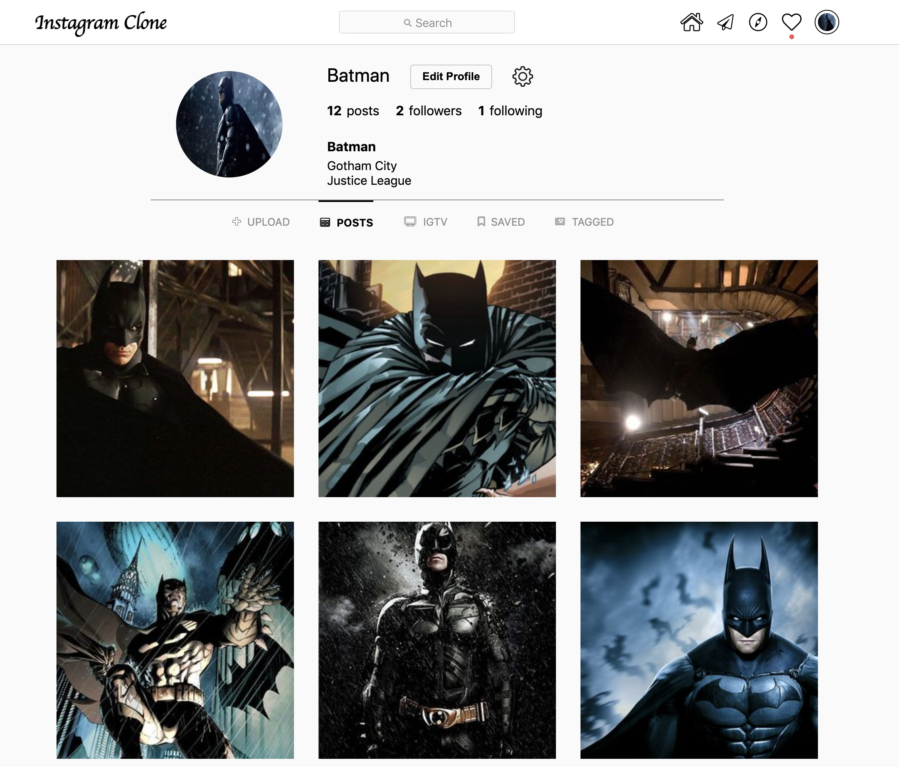
</kbd>
<br> 
<br> 
<br> 

Looking at another users profile that is not followed
<br> 
<kbd>
  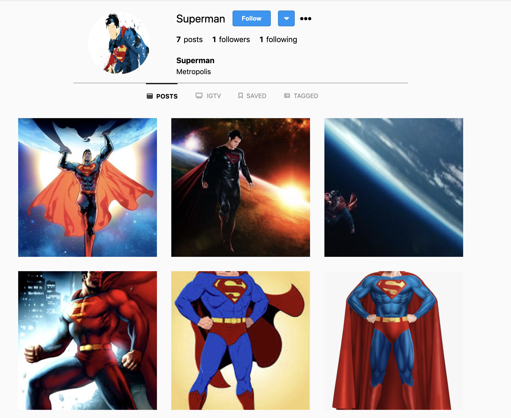
</kbd>
<br> 
<br> 
<br> 

Showing the responsiveness of user profiles
<br> 
<kbd>
  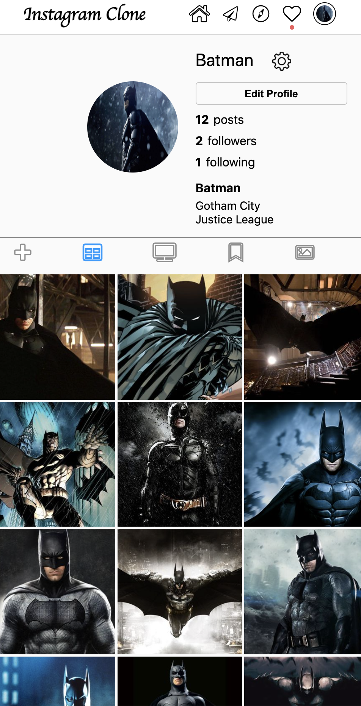
</kbd>
<br> 
<br> 
<br> 

Viewing all users that are followers of this user
<br> 
<kbd>
  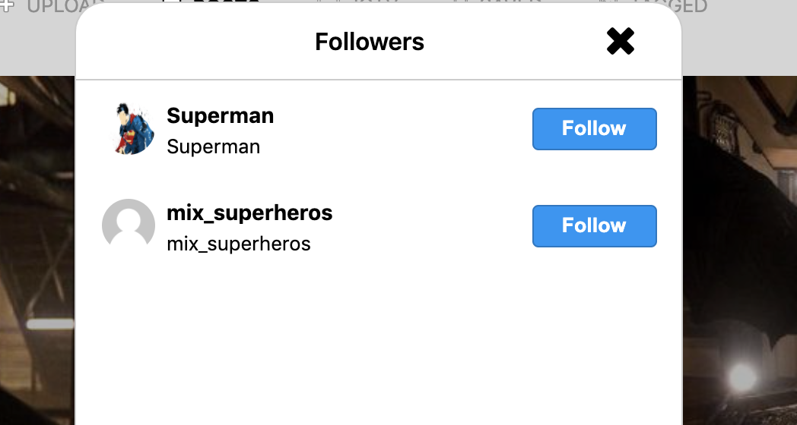
</kbd>
<br> 
<br> 
<br> 

Viewing all users this user is following
<br> 
<kbd>
  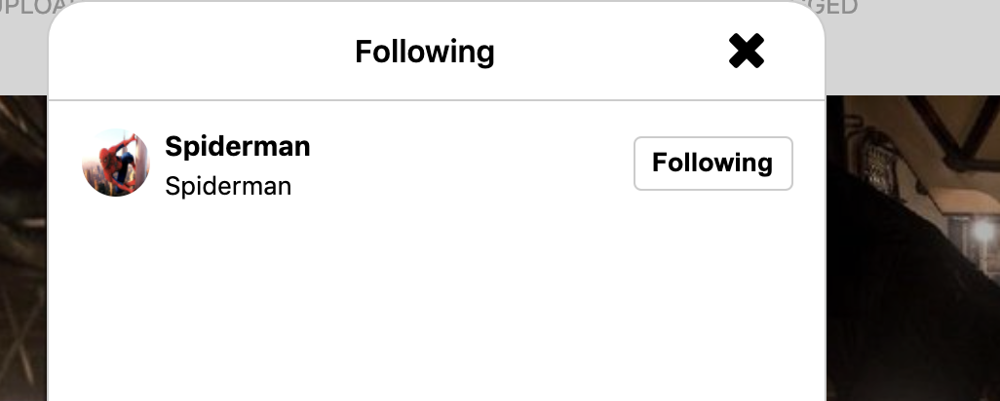
</kbd>
<br> 
<br> 
<br> 

Looking up other users through the search bar
<br>
<kbd>
  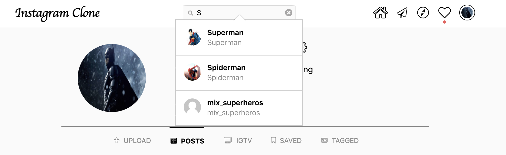
</kbd>
<br> 
<br> 
<br> 

Focusing in on one image by clicking on it 
<br>
<kbd>
  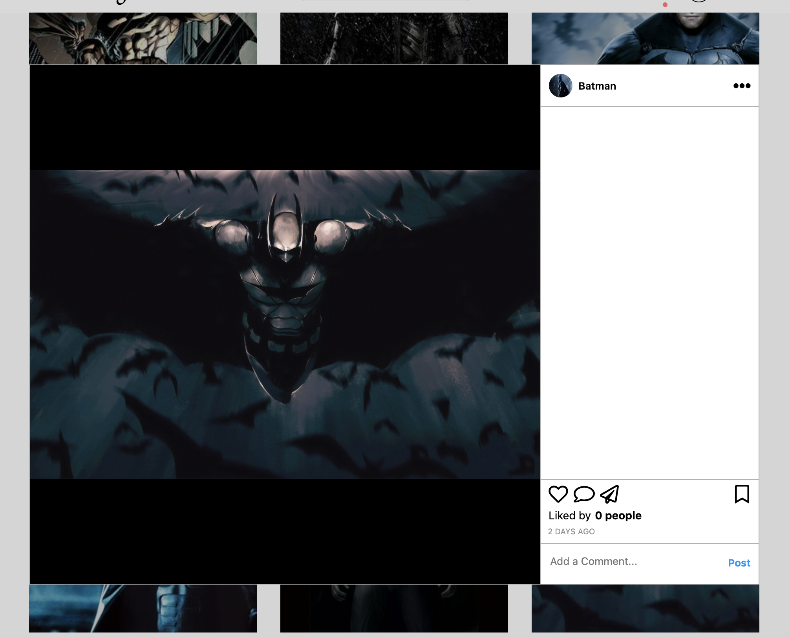
</kbd>
<br> 
<br> 
<br> 

Focused in on one image responsive
<br>
<kbd>
  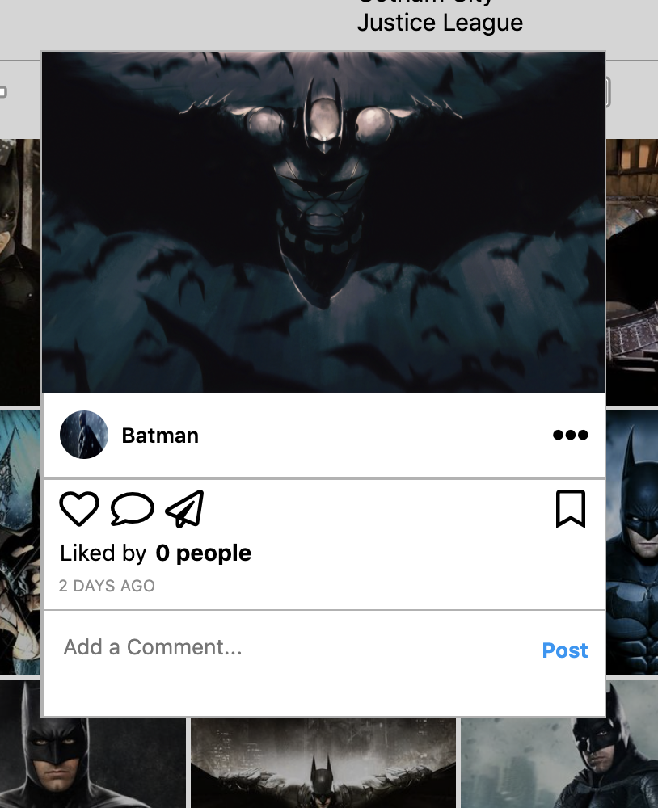
</kbd>
<br> 
<br> 
<br> 

Viewing homepage posts 
<br>
<kbd>
  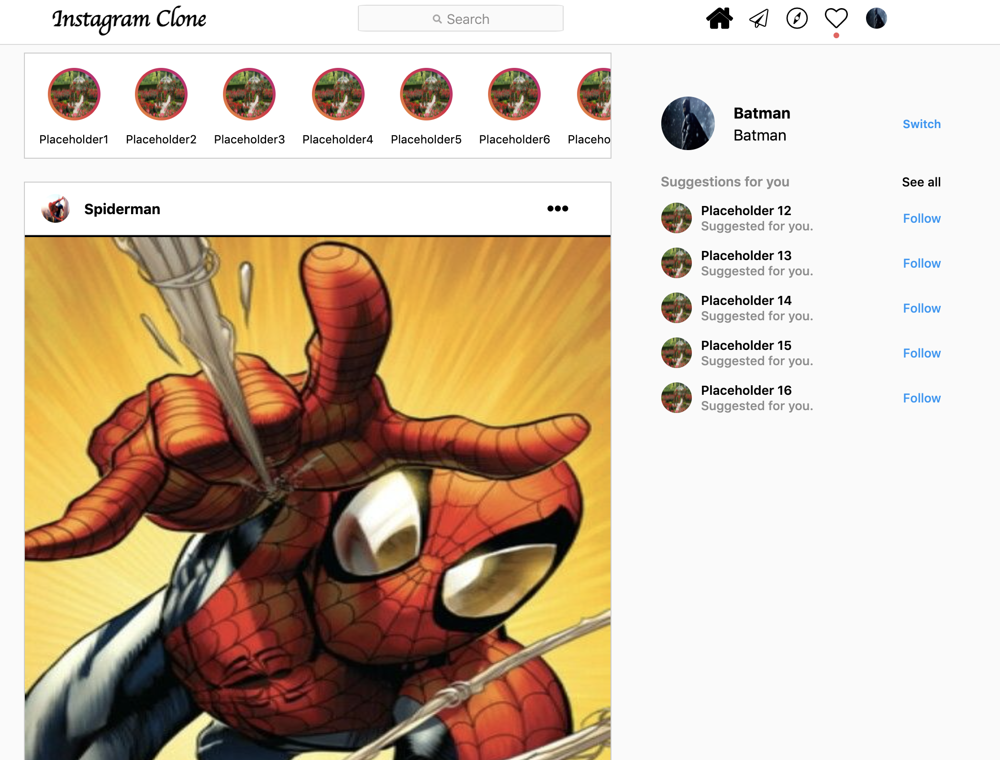
</kbd>
<br> 
<br> 
<br> 

Responsive homepage posts
<br>
<kbd>
  
</kbd>


## Installation
```
git clone https://github.com/13jk59/ig_clone.git
cd backend
touch .env
```
Then, go into the .env file and add the following properties:
- NODE_ENV='production'
- MONGO_URL= '...' (IE: Setup a Mongo DB database and obtain the key for that instance and insert here) 
- ACESS_TOKEN_SECRET = '...' 
- REFRESH_TOKEN_SECRET = '...'

The access token secret and refresh token secret can be any string. 

Afterwards, run npm start in the root directory. 
